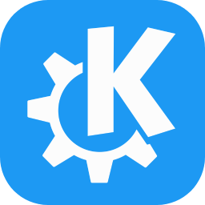

	<h1>¡Hi  I'm Ashley!</h1>
	<h3>A random girl on the internet and a passionate to code.</h3>

 

	<!-- https://github.com/lowlighter/metrics -->
	
	

 
 
 
 

	<!-- https://github.com/tandpfun/skill-icons#readme -->
	<h3 align="center">Languages, technologies and tools that I usually use.</h3>
	
	
	
	
	
	
	
	
	
	
	
	
	
	
	
	
	
	
	
	
	
	
	
	
	
	
	
	
	
	
	
	
	

	<!-- https://github.com/Ashutosh00710/github-readme-activity-graph -->
	

