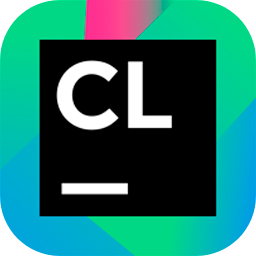
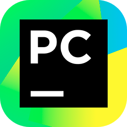
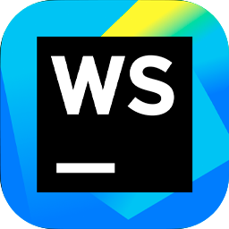

	<h1>¡Hi  I'm Ashley!</h1>
	<h3>A random girl on the internet and a passionate to code.</h3>
	<h6>(CS student, monster energy addict, eepy, and a f̶r̶i̶e̶n̶d̶l̶y coding witch)</h6>

	<!-- https://github.com/lowlighter/metrics -->
	
	

	<!-- https://github.com/tandpfun/skill-icons#readme -->
	<h3 align="center">Languages, technologies and tools that I usually use.</h3>
	
	
	
	
	
	
	
	
	
	
	
	
	
	
	
	
	
	
	
	
	
	
	
	
	
	
	
	
	
	
	

	<!-- https://github.com/Ashutosh00710/github-readme-activity-graph -->
	

